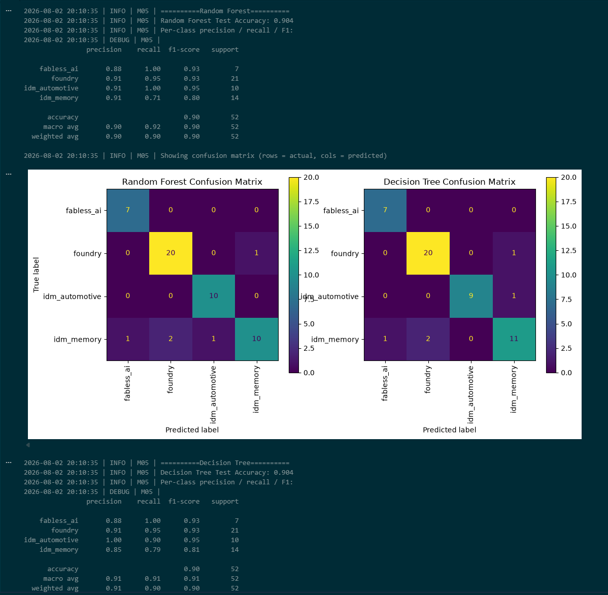

# Project Documentation

This site provides project documentation.
Use the documentation navigation to explore.

## How-To Guide

Many instructions are common to all our projects.

See
[⭐ **Workflow: Apply Example**](https://denisecase.github.io/pro-analytics-02/workflow-b-apply-example-project/)
to get the example projects running on your machine.

## Project Documentation Pages (docs/)

- **Home** - this documentation landing page
- [**Project Instructions**](./project-instructions.md)  - the standard project workflow
- [**Your Files**](./your-files.md) - how to copy the example and create your version
- [**Glossary**](./glossary.md) - project terms and concepts
- [**API**](./api.md) - autogenerated code documentation for the public project interface

## Phase 4. Technical Modification

Describe your small technical modification to the example project.

Include:

- What you changed: Added train vs. test accuracy graphs for single model and random forest classifer.
- Why you chose that change: To analyze the efficiency of both on given data set.
- How you verified that it worked: Ran it.
- What result, output, chart, metric, or behavior confirmed the change: Although the random forest classifer is more accurate set with 200 n_estimators, the decision tree (single model) requires much less resources to compute with relatively similar accuracy. We can see from just one tree in the random forest that the accuracy is lower than the single model. It takes, at minimum, 2 trees to reach or surpass the single model accuracy and about 25 trees to level off. I don't believe the data set is large or varied enough to justify the extra resources required to train the ensembles. Ultimately, choosing the single model for this case is the better option.

Compared with the example project,
explain what is different and why the change matters.

Was it easy, or surprisingly challenging and why do you think so? The implementation was relatively easy. The difficult part was making a decision on how I wanted to analyze the models and how deep I needed to go to create enough understanding without being to burdensome.

## Phase 5. Custom Project

Describe your custom project and how you made your modeling decisions.

Be specific about what changed from the example project.

I wanted to predict segment based on feature columns revenue_usd_bn, operating_margin_pct, operating_income_usd_bn, and capex_usd_bn.

### Basis and Data

Describe the dataset, input, or example you started with.

Include:

- The original example dataset or input: Global Semiconductor Industry 2010-2026
- The data source: Kaggle
- Why you chose it, kept it, or changed it: I really want to make this data set viable.
- Any important limitations or assumptions:

### Modeling Approach

Describe the problem type and modeling approach for this project.

Include:

- Is this supervised or unsupervised and how do you know: Supervised as all the data is labeled and given
- Is this classification, regression, clustering, recommendation, forecasting, or another type of ML task: Classification
- What kind of target works well for this approach: Categorical
- Why your selected model or method is appropriate: I wanted to be able to predict the segment each company focused on based on their financial data. Testing and evaluating the data, I found that there may be too many different segments to be able to predict accurately as it seems there is overlap of the financial data between segments. Certain segments have financial data that is too similar to train on to be able to predict. It's almost the flip of a coin to predict two segments with similar financial data.

### Target

Describe the example target variable.

Then describe your chosen target variable.

Explain how your target choice changes the modeling approach, interpretation, or evaluation.

The example target from the Penguins dataset was species. A categorical target. The target I chose for my dataset was segment, which is also a categorical target. But, my target has about 450 unique values, whereas species there is only 4. Having 11 times as many choices exponentially increases the decision making and complexity within the model.

### Features

Describe the example features.

Then describe the features you used to predict your target.

Explain what you changed, added, removed, or kept and why.

Used all financial data features. There is too much variability between all features and I need to PCA to evaluate features I can drop. All models did not do well using all data and I had to cut all but the top 4 segments to get an ideal model accuracy for each model. I created a correlation matrix and Pearson correlation coefficients for each features used but did not testing. Tested dropping features based on low coefficient, which resulted in underfitted data and lower accuracies.

### Evaluation and Results

Describe how you evaluated your model.

Include:

- The metric or evidence you used
- The main result
- Whether the result was useful, interesting, surprising, or disappointing
- Any weakness, limitation, or next improvement

Initially, I took all the data and found the Random Forest Classifier to be the best model, but only with a 68.5% accuracy. Then, I cut the segments down and only used the top 4. With this, I found the single model and the random forest had the same accuracy at 90.4%. The random forest does much better than with the large amount of data as the single model had an accuracy around 50%, or a coin flip. Not very ideal. Reducing the segments had much better results as I had suspected there were too many decisions to funnel the correct output. If I had the time, I would reduce the dimensionality via principal component analysis to find which financial features have less overlap and make a better prediction with all segments involved.

### Summary

Summarize your custom project.

Include:

- How you implemented your custom model
- What results you got
- What you learned
- How well you exercised the skills covered in this project
- What kinds of real problems you could apply these skills to in the future

Display at least one image or screenshot showing your work.

